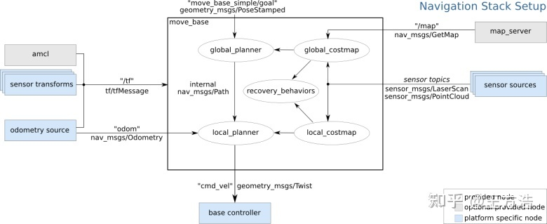

# rm2023_auto_sentry_ws
 RM2023华南农业大学Taurus机器人战队哨兵定位导航算法与仿真开源

RM2022自动步兵开源链接https://github.com/SCAU-RM-NAV/rm2022_auto_infantry_ws

## 简介
本项目提供一种低成本二维激光雷达的哨兵导航定位算法实现，并在RMUC仿真赛场上实现，将详细讲述技术点、使用方法和原理，希望能对其他队伍有所帮助。受限于时间原因，部分内容将以后进行补充。

我们哨兵机器人使用了二维激光雷达的方案，整体算法架构与navigation框架类似，在此基础上改进了定位和轨迹跟踪算法，使之能够实现快速的定位修正和小陀螺过程中的导航，同时实现了定位丢失后的重定位。

项目环境
* Ubuntu20.04
* ros Noetic

硬件环境
* intel i7-1165G7工控机

## 代码框架
```
 src
    ├── 4ws_auto_infantry   仿真模型功能包
    │   ├── CMakeLists.txt
    │   ├── config 参数配置文件
    │   ├── launch
    │   │   ├── display.launch
    │   │   ├── display_rviz.launch
    │   │   └── gazebo.launch
    │   ├── meshes  STL文件目录
    │   ├── package.xml
    │   ├── robots
    │   │   └── 4ws_auto_infantry.xacro
    │   ├── urdf
    │   └── world 赛场仿真模型
    ├── CMakeLists.txt -> 
    │
    ├── auto_nav    导航算法功能包
    │   ├── CMakeLists.txt
    │   ├── cfg
    │   │   └── tracks_follow.cfg
    │   ├── config 参数配置文件夹
    │   ├── example
    │   │   ├── pid.c
    │   │   └── pid.h
    │   ├── include
    │   │   ├── cubic_spline
    │   │   │   ├── cpprobotics_types.h
    │   │   │   ├── cubic_spline.h
    │   │   │   └── cubic_spline_ros.h
    │   │   ├── pid.h
    │   │   ├── pid_position_follow.h      pid轨迹跟踪头文件
    │   │   └── utility.h
    │   ├── launch
    │   │   ├── amcl_simple_meca_car.launch
    │   │   ├── gmapping.launch
    │   │   ├── gmapping_demo.launch
    │   │   ├── navi_simple_meca_car.launch
    │   │   ├── navi_simple_meca_car_pid.launch 导航定位算法launch文件
    │   │   ├── pid_follow_planner.launch
    │   │   └── simple_meca_car_gmapping.launch
    │   ├── map 地图
    │   ├── package.xml
    │   └── src
    │       ├── pid.cpp
    │       └── pid_position_follow.cpp
    ├── rmus_map_2  仿真模型功能包
    │   ├── CMakeLists.txt
    │   ├── config
    │   │   └── joint_names_RMUS_map_2.yaml
    │   ├── export.log
    │   ├── launch
    │   │   ├── display.launch
    │   │   └── gazebo.launch
    │   ├── meshes
    │   │   └── base_link.stl
    │   ├── package.xml
    │   └── urdf
    │       ├── RMUS_map_2.csv
    │       └── rmus_map_2.urdf
    ├── roborts_msgs 消息类型功能包
    │   ├── CMakeLists.txt
    │   ├── msg     自定义消息类型
    │   ├── package.xml
    │   └── srv
    │       ├── PidPlannerStatus.srv
    │       └── Relocate.srv
    ├── scan_to_map  定位算法功能包
    │   ├── CMakeLists.txt
    │   ├── include
    │   │   └── scan_to_map_location.h
    │   ├── launch
    │   │   ├── robot_localization_icp.launch
    │   │   └── scan_to_map_location.launch 
    │   ├── package.xml
    │   ├── param
    │   │   └── robot_localization.yaml robot_localization功能包参数
    │   ├── script
    │   │   └── test.py
    │   └── src
    │       ├── SnapMapICP.cpp
    │       └── scan_to_map_location.cpp
    └── simple_meca_car 仿真小车功能包

```
## 使用方法
克隆存储库并catkin_make：
```
cd ~/catkin_ws/src
git clone https://github.com/SCAU-RM-NAV/rm2023_auto_sentry_ws.git
cd ../
catkin_make
source ~/catkin_ws/devel/setup.bash
```
启动仿真
```
roslaunch simple_meca_car race.launch 
```
启动定位与导航
```
roslaunch auto_nav navi_simple_meca_car_pid.launch 
```

## 算法原理

ROS中的navigation提供了一套框架，可以让我们灵活的选择global_planner 、local_planner 来提供路径规划功能，navigation原本框架就能实现基本的导航与定位功能
以下为ROS导航模块官方的框图：



本项目在上述框架基础上改进了定位和轨迹跟踪算法

在定位模块中，使用里程计数据维护odom到base_link的坐标变换（实际项目中也可以使用3维激光里程计，可以得到更好的效果），同时使用激光雷达点云数据和地图点云数据进行ICP点云配准，得到全局坐标系下机器人定位，使用开源的robot_localization实现EKF，融合ICP得到的全局坐标和里程计和imu的数据，维护map到odom这段tf的变换。

在轨迹跟踪模块中，读取全局路径规划模块中的全局路径，根据前视距离参数取一段路径，使用贝塞尔曲线进行轨迹平滑，然后使用位置pid进行轨迹跟踪，同时做了角速度映射，实现了小陀螺过程中导航。